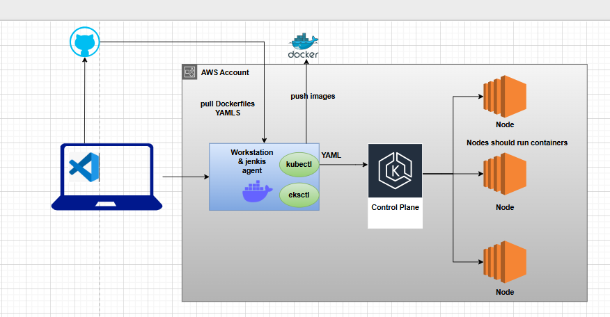
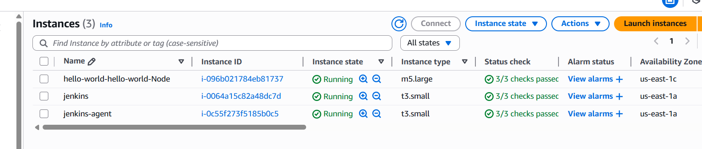
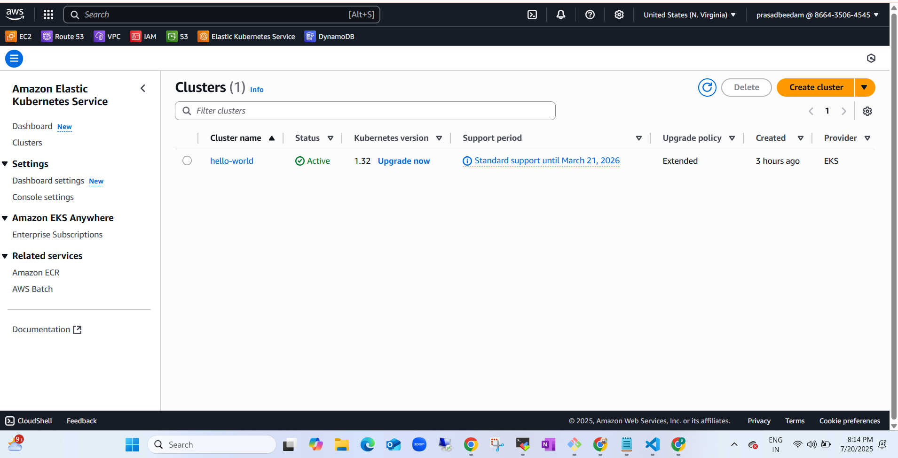

# CI/CD Automation for Hello World App

# Project Overview

## Overview

This project automates the build, test, and deployment process of a simple Node.js “Hello World” application using a CI/CD pipeline. Whenever a developer pushes code to the main branch in GitHub, the following steps are triggered automatically:

- CI pipeline builds a Docker image
- Runs a container for testing and health checks
- Pushes the Docker image to Docker Hub
- CD pipeline picks up the version and deploys it to a Kubernetes cluster

This ensures reliable, repeatable, and zero-touch deployments.

---

## Tools and Technologies Used

- **GitHub**: Source code management and Webhooks
- **Jenkins**: CI/CD automation tool
- **Docker**: Containerization platform
- **Docker Hub**: Container registry for storing images
- **Kubernetes**: Container orchestration platform
- **EC2 (Amazon Linux)**: Jenkins master and agent hosted on AWS
- **Webhooks**: GitHub to Jenkins trigger integration

---

## Repository Structure

The Node.js application and relevant files are located in:

examples/hello-world/
├── Dockerfile
├── index.js
├── package.json
├── deployment.yaml

- `package.json`: Contains version information for tagging Docker images
- `deployment.yaml`: Kubernetes deployment configuration
- `Dockerfile`: Defines image build instructions

---

## CI Pipeline Workflow (Jenkins)

1. **Triggered by GitHub Push**: GitHub webhook notifies Jenkins of a new commit on the `main` branch.
2. **Checkout Code**: Jenkins pulls the latest code from GitHub.
3. **Read Version**: Reads version from `package.json` and uses it for tagging.
4. **Build Docker Image**: Builds the image using the app's Dockerfile.
5. **Run Test Container**: Runs the container temporarily to validate application functionality.
6. **Health Check**: Sends HTTP request to ensure service is running.
7. **Push to Docker Hub**: Pushes the versioned image to Docker Hub using credentials stored securely in Jenkins.
8. **Trigger CD Job**: Passes the version tag to the CD pipeline.

---

## CD Pipeline Workflow (Jenkins)

1. **Accepts Version Parameter**: Receives version (e.g., `1.0.0`) as input.
2. **Checkout Code**: Pulls the latest deployment configuration from GitHub.
3. **Update Image Tag**: Updates `deployment.yaml` with the new Docker image tag.
4. **Deploy to Kubernetes**: Applies the updated configuration using `kubectl`.

The updated application is deployed into the `hello-world` namespace.

---

## Deployment Automation Flow

1. Developer commits code and pushes to GitHub.
2. Webhook triggers Jenkins CI pipeline.
3. Jenkins builds, tests, and pushes Docker image.
4. Jenkins triggers the CD job with the correct image version.
5. Jenkins CD deploys the image to Kubernetes using `kubectl apply`.

---

## Best Practices Followed

- Version tagging with `package.json` for traceability
- Health checks before pushing to Docker Hub
- Credential management via Jenkins credentials plugin
- Separation of CI and CD pipelines for modularity and control
- Use of Webhooks for real-time automation triggers

---

## Summary

This project delivers a complete CI/CD solution using open-source tools and cloud infrastructure. The entire process — from code commit to deployment — is fully automated, enabling rapid delivery, consistency, and reduced manual overhead.

## Servers

## Cluster

## Summary

## Summary

